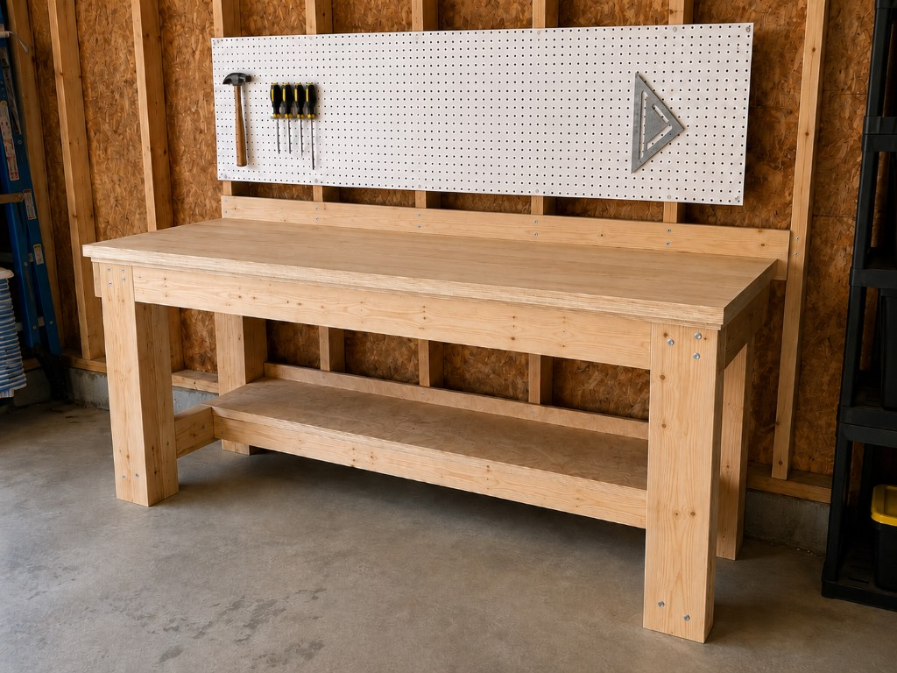

# Stud-Anchored Workbench with Lower Shelf

A wall-anchored garage workbench for unfinished stud walls — designed with [Claude](https://claude.com), built from ~$216 in materials, no glue, pocket-hole joinery throughout.



**60"W × 24"D × 36⅛"H** · glue-free · beginner-friendly

---

## What is this repo?

This is **not** an application or library. It is documentation and an interactive build guide for a single DIY project: a stud-anchored workbench with a lower shelf and optional pegboard.

If you landed here from GitHub search or a link, you are in the right place if you want to **build this bench** or **see how an AI-assisted design workflow produced a complete cut list, fastener plan, and step-by-step instructions**.

The bench bolts its back edge directly to your wall framing (the studs behind unfinished drywall or bare garage walls). Two front legs and kickers brace the front — the building carries most of the load, so the bench stays stiff without store-bought hardware or complicated joinery.

---

## Build guides

| Resource | What it is |
|----------|------------|
| **[Interactive 3D build guide](https://dpappo.github.io/workbench/)** | Step through all 26 steps in 3D — prep, cutting, and assembly, with dimension callouts, per-step tool/fastener chips, joint cross-sections, and to-scale cut-plan diagrams |
| **[Written build guide](stud-anchored-workbench-build-guide.md)** | Full printable reference: buy list, cut order, geometry checks, and every step in prose |

The 3D guide is served from [`index.html`](index.html) via GitHub Pages. The markdown guide is the long-form plan you can read offline or print.

---

## Design highlights

- **Stud-anchored ledger** — the back of the top hangs off the wall; no rear legs
- **Doubled 2×4 frame** — beam and legs are two boards screwed face-to-face for stiffness
- **Kickers + shelf diaphragm** — legs tie back to the wall; the shelf deck locks the frame against racking
- **Pocket-hole joinery** — all 40 angled joints (joists, kickers) use a Kreg 320 jig, drilled while parts are loose on the bench; only the rail and optional post keep old-school toe-screws
- **Replaceable hardboard top** — sacrificial wear surface; swap it for ~$11 when it gets beat up
- **Open stud bays** — pegboard mounts directly to studs; no spacer strips needed

Roughly **$172** for the bench itself, **~$216** with pegboard, plus a **$49** Kreg 320 pocket-hole jig you'll reuse forever (prices from a Canadian big-box run; your mileage may vary).

---

## Repo contents

```
.
├── index.html                          # Interactive 3D build guide (GitHub Pages)
├── stud-anchored-workbench-build-guide.md   # Full written build plan
├── assets/workbench.png                # Photo of the finished bench
└── .github/workflows/pages.yml         # Deploys the 3D guide to GitHub Pages
```

---

## About the design process

The geometry, fastener logic, kerf-aware cut list, and teaching copy were developed in conversation with **Claude** — iterating through five verification passes on stability, knee clearance under the shelf, fastener physics (why a 2½" screw can't span a doubled member), and beginner-friendly explanations (pocket holes vs. toe-screws, doubled members, why floors slope). The 3D guide visualizes each step so you can see what you're building before you cut.

Built it? Issues or improvements welcome.
